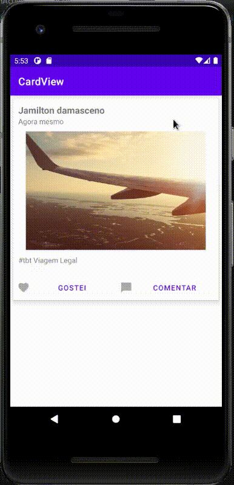

<h1 align="center">
 
  
 
 
CardView
</h1>

Description

Implement the Material Design card pattern with round corners and drop shadows.

  

[//]: # (Add your gifs/images here:)

  
  
  
  [//]: # ()

## Features
[//]: # (Add the features of your project here:)

- ⚛️ **Java 8**
- ⚛️ **Cardview** — https://developer.android.com/jetpack/androidx/releases/cardview.

## Getting started

Compile with Android Studio and run.

## License

This project is licensed under the AOSP (Android Open Source Project) - see the [LICENSE](http://www.apache.org/licenses/LICENSE-2.0) page for details.
